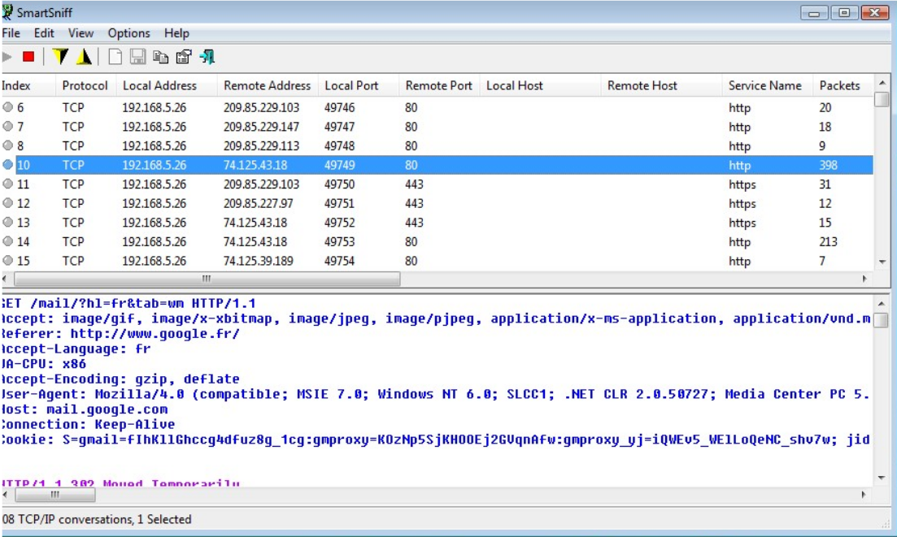

# TUTO SmartSNIFF
    SmartSNlFF est un Freeware de la société NirSoft, spécialisée dans les utilitaires d’analyse du 
    système.

comme tous les utilitaires de ce type, il peut être considéré par votre antivirus comme un logiciel potentiellement dangereux et voir son téléchargement bloqué..
---

1. Vous devez commencer par installer WinPCap sur votre système (SmartSniff permet en théorie d’analyser le trafic sans installer WinPCap mais, sous XP comme sous Vista, seul le trafic entrant est affiché et le trafic TCP n’est pas capturé)
Installez le logiciel en suivant l’assistant d’installation ‘d’autant plus trivial qu’il ne propose aucun paramétrage).

2. il est possible d’installer SmartSNIFF: Décompactez l’archive ZIP dans un dossier SmartSniff, sur le bureau par exemple . Le logiciel ne nécessite aucune installation. Il s’exécute directement dès que vous double-cliquez sur le programme SMSNIFF. Le programme peut être donc placé sur et lancé depuis une clé USB.

3. Ouvrez le menu **Options** et déployez le sous-menu **Display Protocols**. Le logiciel permet de surveiller les paquets TCP, UDP ou ICMP. D’une manière générale, on étudiera la plus grande partie du temps des paquets TCP. Donc,il est préférable de décocher les options UDP et ICMP pour éviter l’affichage des paquets inutiles.

4. Pour lancer la capture des paquets, allez dans le menu **File** et cliquez sur **Start Capture** (ou cliquez sur la touche **[F5]**).Le logiciel devrait afficher une boîte **Capture Options** (si cette boîte n’apparaît pas, allez dans le menu **Options** et sélectionnez **Capture Options**). Sélectionnez WinPcap puis l’interface réseau à surveiller.

5. Lancez le logiciel de communication Internet que vous souhaitez surveiller/analyser ou votre navigateur Web. Tous les paquets de données entrants et sortants de votre ordinateur seront affichés.

6. Après avoir réalisé les opérations souhaitées, stoppez la capture des paquets en appuyant sur la touche **[F6]**.Vous pouvez alors tranquillement analyser ce qui s’est passé. Il suffit de cliquer sur un événement dans la liste supérieure pour voir s’afficher dans la zone inférieure de la fenêtre le détail des données échangées.
---
Supposons maintenant que vous vouliez vérifier si un mot de passe a été transféré en clair à travers le réseau :
- Cliquez sur la liste de la zone supérieure de la fenêtre.
- Appuyez sur les touches **[Ctrl]+[A]** poursélectionner tous les événements.
- Cliquez sur la sélection du bouton droit de la souris et sélectionnez **HTML Report**.
- Utilisez les fonctions de recherche dans la page **([Ctrl]+[F])** pour chercher si le mot de passe est présent dans la liste des paquets.